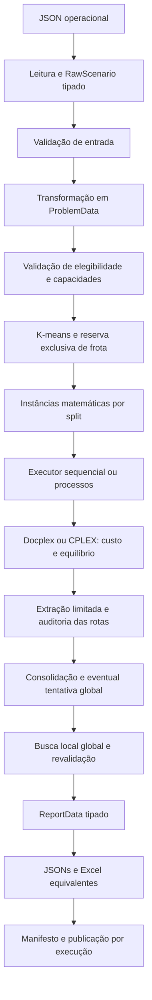

# Arquitetura executável

Este template resolve CVRP a partir de dados operacionais, com contratos tipados
entre etapas. A [revisão e plano de 2026-10-07](review-and-plan.md) é uma auditoria
histórica; problemas e entregas descritos ali devem ser lidos na data da revisão.
Este documento descreve a implementação atual. As entregas de contratos,
modelos, FOs, splits, pós e relatórios do plano foram implementadas; a comparação
controlada com Java e as evoluções futuras de escala continuam abertas.

## Contratos e módulos

| Módulo | Responsabilidade |
| --- | --- |
| `domain/raw.py` | Entidades operacionais decodificadas |
| `io/reader.py` | Fronteira JSON e erros de entrada |
| `validation/input.py` | Referências, unicidade, números, datas e regras estruturais |
| `transform/build_instance.py` | Filtros, agregação, conversão de unidades e materialização por split |
| `domain/instance.py` | `ProblemData`, entidades, viagens, splits e índices matemáticos |
| `preprocess/cluster.py` | Partição geográfica, alocação exclusiva e fallback |
| `model/builder_docplex.py` | Formulação diretamente na API algébrica Docplex |
| `model/builder_cplex.py` | Mesma formulação na API matricial CPLEX |
| `solve/lexicographic.py` | Etapas sucessivas e preservação do incumbente |
| `solve/executor.py` | Mesmo solve por split em sequencial ou processos |
| `report/routes.py` | Extração de rotas com guarda contra ciclos e arcos excedentes |
| `validation/solution.py` | Auditoria independente e métricas das rotas concretas |
| `postprocess/local_search.py` | Relocate, swap e 2-opt com orçamento |
| `report/data.py`, `projector.py` | Registros tipados e envelope agregado |
| `io/writer.py` | JSON, Excel e publicação atômica com manifesto |
| `pipeline.py`, `__main__.py` | Orquestração e interface de cenário |

Objetos de domínio usam dataclasses com slots. Mapas internos seguem ownership:
são construídos uma vez e não devem ser alterados por consumidores; `frozen`
não torna seus conteúdos profundamente imutáveis. Não há DataFrame no fluxo.
O pipeline entrega objetos serializáveis, sem modelos ou soluções nativas do
solver. Cada backend fica em módulo específico, com variáveis, famílias,
objetivos, extração e fechamento explícitos.

## Preparação e divisão

Pedidos confirmados para CD/data são deduplicados, agregados e convertidos em
kg/m³. Descartes e decisões geram diagnósticos. Valores não finitos, quantidades
negativas/fracionárias indevidas e manutenção inconsistente são rejeitados.
Cada cliente deve caber nas duas dimensões em um mesmo veículo elegível com
ida/retorno ao depósito. Isso é necessário, mas não prova viabilidade de packing
ou de todas as rotas.

`complete_with_geography` usa overrides direcionais e haversine para distâncias
faltantes. `provided_only` autoriza somente arcos informados. A instância esparsa
com distâncias, custos e adjacências é materializada depois da divisão.

K-means usa quatro clusters desejados, seed 42 e `n_init=10`; coordenadas usam
projeção equiretangular local em km para operações regionais. Roteamento usa as
distâncias reais do problema, não essa projeção. O número de clusters é limitado
por clientes, posições distintas e veículos utilizáveis. A reserva gulosa da
frota prioriza clientes com menos opções e verifica peso/volume. Se falhar,
reduz clusters até o problema único. Uma partição que falha no solve também
pode provocar tentativa única global dentro do orçamento restante.

## Resolução, recursos e status

O modo padrão é sequencial. O paralelo usa `ProcessPoolExecutor` com `spawn`,
cria cada solver no processo filho e devolve `SplitResult`. Resultados são
ordenados por ID. Configuração valida o orçamento de CPUs. O executor estima memória pelo tamanho
potencial do modelo, reduz workers quando necessário e rejeita splits acima do
orçamento configurado; essa estimativa não impõe um teto de RSS. O solver também
recebe workmem e política de arquivos de nós. Modelos e dados continuam sujeitos
à memória e licença disponíveis. Deadline total é
cooperativo: controles entre etapas e time limit dos solves não garantem
interrupção estrita de clustering/build/chamadas nativas/escrita.

Defaults: 30 s de solve por split, FO1 com 70% do tempo, gap 1%, um thread,
tolerância absoluta de custo 1e-6 e relativa zero, 5 s e 10.000 candidatos no pós.
Tempo total sequencial pode somar orçamentos de vários splits e tentativas, além
de preparação/build/escrita. Configure deadline global quando necessário.

`feasible` exige todos os clientes atendidos e auditoria global válida. `empty`
não chama solver. `partial` preserva rotas válidas dos splits resolvidos sem
alegar atendimento completo. `no_incumbent` não inventa rotas e não afirma
inviabilidade do problema original. Falhas dos workers são diagnósticos do
split. Entrada inválida levanta `InputError` na biblioteca; a CLI publica
`invalid_input` e termina com código 2. Resultado incompleto termina com código 1;
sucesso e vazio terminam com código 0.

## Pós e relatórios

A busca local usa o problema global, inclusive pares entre clusters. Cada
candidato preserva atendimento, veículos físicos, circulação e capacidades;
arcos assimétricos são recalculados. O teto FO1 original e o menor custo já aceito ancoram a tolerância de toda a
busca, evitando aumentos acumulados após uma redução grande de custo e
preservando as prioridades do melhor resultado validado.
A solução final registra métricas antes/depois, tempo, candidatos, movimentos e
motivo de parada. Bound/gap seguem vinculados às etapas originais.

Uma única projeção alimenta JSON e Excel, com cabeçalhos em conteúdos vazios,
listas reversíveis e recálculo dos KPIs das rotas finais. Publicação usa staging,
manifesto, checksums e rename por execução. Veja o [contrato de saída](output-data.md)
e o [modelo executado](model.md).

## Medição e evolução

Lint habilita C901 com limite 9; mypy verifica definições tipadas. Testes cobrem
os dois backends, auditoria, FOs, fallback, processos, pós e paridade de relatórios.
O benchmark usa processos independentes por amostra, três repetições por padrão
e alterna a ordem dos backends. Modos `build`, `pipeline` e `both` separam build
sem solve/cluster e pipeline com clusters configurados. Registra métricas por
etapa/FO, escrita, qualidade, tamanho de modelo e picos de RSS do processo e
maior filho encerrado; não mede RSS simultâneo agregado. `metrics.json` por
amostra e `benchmark-summary.json` preservam os resultados. Não há evidência
comparativa com Java: ganhos dependem da instância, solver, hardware, formulação,
threads e tolerâncias. Modelos compactos removem DFJ exponencial, mas tamanho
polinomial não garante solve rápido. Mudanças de parser, cache ou abstrações
adicionais devem responder a medições do trecho dominante.
