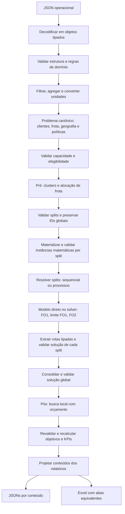

# Revisão da arquitetura e plano de evolução

Revisão realizada em 2026-10-07 sobre o código deste repositório. Este documento
separa a implementação verificada da arquitetura proposta. As etapas futuras
descritas abaixo **ainda não estão implementadas**.

> Registro histórico da revisão inicial. O plano foi implementado posteriormente
> nesta mesma sessão, com a alteração solicitada de manter **ambos** os backends
> nativos em `builder_docplex.py` e `builder_cplex.py`. Consulte
> [architecture.md](architecture.md), [model.md](model.md) e
> [output-data.md](output-data.md) para o comportamento atual. As evidências e
> referências de linhas abaixo descrevem a versão anterior à implementação;
> a decisão entre backends e a comparação com Java continuam dependendo de
> benchmarks representativos.

## 1. Parecer

A implementação atende parcialmente ao objetivo de ser um template de PO:
há uma fronteira de transformação, uma instância matemática, builders,
resolução e relatório. O uso de objetos com `slots`, índices inteiros e arcos
válidos é uma boa base, e não há dependência de DataFrames.

O fluxo atual é `dict bruto → InstanceData → modelo → solução → dict de saída`.
Faltam contratos tipados na entrada e na solução, validações mais completas,
pré-processamento com decomposição, execução sequencial/paralela dos splits,
objetivos lexicográficos, pós-processamento, validação independente da solução
e publicação dos mesmos conteúdos em JSONs e Excel.

Não há evidência suficiente para afirmar desempenho superior ao Java. Antes
disso, é necessário remover o crescimento exponencial da construção do modelo
e medir tempo, memória e qualidade em cenários representativos.

### Matriz de aderência

| Requisito | Situação verificada | Ação proposta |
| --- | --- | --- |
| Fluxo de aproximação ao modelo e retorno ao negócio | Parcial: quatro etapas | Explicitar contratos e validações entre etapas |
| Objetos e acesso por ponto | `Vehicle` e `InstanceData`; entrada, solução e saída usam `Any`/dicts | Tipar entidades operacionais, rotas, métricas e resultados |
| Evitar DataFrames | Atendido no código atual | Manter projeções por iteradores de objetos |
| Validação estrutural, numérica e de negócio | Parcial e misturada à transformação | Separar entrada, instância e solução |
| Pré-processamento e quatro clusters | Ausente | K-means, distribuição de frota e diagnóstico dos splits |
| Splits sequenciais/paralelos | Ausente | Mesma função de resolução, executores sequencial e por processos |
| FO1 custo e FO2 equilíbrio de paradas | Só FO1 | Execuções sucessivas com limite da FO anterior |
| Time limit, threads e tolerâncias | Não configurados pelo pipeline | Configuração tipada e orçamento explícito |
| Pós-processamento | Ausente | Busca local limitada e validação de cada candidato |
| JSONs com paridade de abas Excel | Um JSON hierárquico | Uma projeção tipada por conteúdo, dois writers |
| Modelo escrito como equações | Docplex já usa generators; CPLEX usa índices/matrizes | Modelo canônico diretamente em Docplex |
| Nomes `r9_i` no LP | Ausente; Docplex ignora nomes | Nomes por família e índices, com exportação LP |
| DRY/KISS | Estrutura pequena; formulação duplicada | Uma formulação canônica e sem DSL própria |
| Complexidade ciclomática < 10 | Ruff C901 passa com limite 9, mas não é habilitado no projeto | Habilitar o gate e revisar comprehensions complexas |
| Desempenho suficiente para substituir Java | Não demonstrado | Benchmark comparável com qualidade e recursos iguais |

### Evidências no código

Referências relativas a `src/cvrp/`, com linhas da versão revisada:

- `pipeline.py:23–43`: orquestra apenas transformação, build, um solve e extração;
  também conhece os detalhes dos dois builders.
- `domain/instance.py:15–30`: o contrato usa atributos, mas contém dicionários
  mutáveis; `frozen=True` não torna esses conteúdos imutáveis.
- `transform/build_instance.py:30–52`: validação, descarte, agregação, distâncias
  e arcos estão no mesmo método, com construção posicional extensa da instância.
- `transform/build_instance.py:112–119`: verifica máximos independentes de peso
  e volume, em vez de um mesmo veículo capaz nas duas dimensões; não considera
  circulação nessa checagem de capacidade individual.
- `transform/build_instance.py:49–51`: valida chegada em algum arco, sem
  explicitar ida, retorno e elegibilidade por veículo.
- `transform/build_instance.py:122–125`: materializa todas as distâncias antes
  de qualquer split e avalia haversine mesmo quando há override, pois o argumento
  default de `dict.get` é calculado antes da chamada.
- `model/builder.py:18`: `ignore_names=True` e `checker="off"`; as famílias R1–R7
  aparecem nos logs, mas não são nomes das restrições exportadas.
- `model/builder.py:85–90,185–211`: os dois builders enumeram todos os subconjuntos
  DFJ. Para n clientes, são `|K| * (2**n - n - 1)` linhas só nessa família.
- `model/builder.py:135–137`: o builder matricial materializa uma estrutura
  `|K| * |V|²`, mesmo quando os arcos válidos são esparsos.
- `solve/solver.py:275–303`: um único solve, sem orçamento ou histórico de FOs;
  ausência de solução primal é reportada como possível problema de runtime.
- `report/extract.py:43–58`: extração e apresentação misturadas, atendimento
  contado a partir da demanda, sem auditoria das rotas; reconstrução sem guarda
  explícita contra ciclos inválidos. A função percorre os arcos repetidamente.
- `__main__.py:12–15`: escreve apenas `output.json`.
- `pyproject.toml:35`: `cvrp:main` aponta para um atributo ausente no pacote;
  a função existe em `cvrp.__main__:main`. Os testes chamam `cli.main()` diretamente.

Há divergência documental: `docs/model.md` apresenta uma formulação homogênea
com uma dimensão de capacidade, enquanto o código tem frota heterogênea,
capacidades de peso/volume, custo por veículo e custo fixo. `docs/output-data.md`
mostra muitos campos e uma projeção flat que o reporter ainda não produz.
`docs/architecture.md` é uma pesquisa de alternativas e escala, não um contrato
do comportamento executável. Esses documentos precisam convergir na entrega.

### Verificação executada

- Suíte existente: **18 testes passaram; cobertura 95,43%**.
- `ruff check .`: falhou em dois F841, variáveis de medição não utilizadas em
  `benchmark.py:43,46`.
- `ruff check src --select C901 --config 'lint.mccabe.max-complexity=9'`: passou.
  Esse resultado não certifica simplicidade das expressões nem tipagem estática.
- Reproduções com `benchmark.create_input(1, 1)`: quantidade de caixas `-1`
  produziu demanda `-10 kg`; veículos `(10 kg, 1 m³)` e `(1 kg, 10 m³)` passaram
  na validação para cliente `(8 kg, 8 m³)`; bloquear o único veículo com capacidade
  suficiente também passou. Os dois últimos casos foram declarados inviáveis
  pelo CPLEX depois da construção.
- Duas linhas de disponibilidade do mesmo tipo geraram IDs de veículo iguais.
- Alterar `data.demand_kg[1]` foi permitido, apesar de `frozen=True`.
- Todas as restrições Docplex no cenário de um cliente ficaram com nome `None`;
  `hasattr(cvrp, "main")` retornou `False`.

O link de `.venv/bin/python` aponta para um interpretador ausente. A suíte foi
executada com o Python 3.14.7 do sistema e os pacotes já presentes na venv, sem
alterar o ambiente:

```bash
PYTHONPATH=src:.:.venv/lib/python3.14/site-packages python3 -m pytest
.venv/bin/ruff check .
.venv/bin/ruff check src --select C901 --config 'lint.mccabe.max-complexity=9'
```

## 2. Fluxo completo proposto



Fluxo sem pré-processamento: retornar um único split. Fluxo sem pós-processamento:
retornar a solução validada sem alterações. Uma instância sem clientes elegíveis
deve produzir resultado vazio válido, sem chamar o solver.

Erros de entrada e resultados sem incumbente também precisam chegar aos
relatórios, com código e contexto, sem produzir rotas fictícias. Uma falha de
split deve marcar a execução como parcial/falha; sucesso global exige todos os
clientes elegíveis atendidos. Não mascarar inviabilidade como falha de instalação.

## 3. Contratos e responsabilidades

Usar classes concretas e pequenas, com anotações de tipos. Não introduzir
hierarquias de factories, repositories, strategies ou uma linguagem algébrica própria.

| Contrato | Conteúdo e acesso esperado |
| --- | --- |
| `RawScenario` | Entidades operacionais: `order.customer_code`, `item.boxes`, `vehicle_type.capacity_kg` |
| `Customer` / `Vehicle` | Identidade global, demandas/capacidades, coordenadas, referências de pedidos |
| `ProblemData` | Entidades canônicas, distâncias informadas e políticas, antes dos índices de cada split |
| `InstanceData` | Clientes, frota, custos e conjuntos matemáticos validados |
| `ProblemSplit` | ID, instância local, mapas local→global e frota exclusiva |
| `PipelineConfig` | Clusterização, executor, solver, tolerâncias, pós e exportação |
| `StageResult` | FO, valor, bound, gap, status, tempo, incumbent e motivo de parada |
| `Route` / `RoutingSolution` | Sequência ordenada, veículo, métricas e resultado consolidado |
| `Diagnostic` | Severidade, código, entidade/split, mensagem e ação tomada |
| `ReportData` | Conteúdos canônicos: resumo, rotas, paradas, objetivos, splits e diagnóstico |

Preferir dataclasses com `slots=True`. Decodificar dicts somente na fronteira de
entrada e serializar somente na saída. Não criar um objeto por coeficiente da
matriz; objetos representam entidades e resultados do domínio.

Mapas indexados por `(i, j, k)` continuam naturais para custos e variáveis. O
acesso por ponto se aplica aos atributos semânticos: `data.customers[i].demand_kg`,
`data.vehicles[k].capacity_kg`, `route.metrics.distance_km`. Evitar replicar a mesma
demanda em múltiplos mapas independentes sem necessidade medida.

Ordenar IDs e arcos para construção/exportação reproduzíveis. Pré-computar
`outgoing[i, k]` e `incoming[j, k]` em uma passagem pelos arcos, evitando varrer
todos os nós em cada restrição. Esses índices devem ser de adjacência, sem uma
matriz densa escondida. Arcos do grafo de entrada só podem ser esparsificados por
política explícita e com diagnóstico da possível perda de viabilidade/qualidade.

Materializar distâncias, custos e arcos **por split, depois da clusterização**.
Construir o grafo completo global antes de dividir preservaria o gargalo de
memória e tempo. O problema canônico conserva coordenadas, overrides direcionais
e circulação; validações de ligações com o depósito não precisam enumerar pares
de clientes. Na busca local global, avaliar os arcos candidatos com essas mesmas
políticas, incluindo pares entre clusters, sem assumir que a ausência na instância
local é uma proibição global. Concentrar o cálculo de distância em uma função
tipada reutilizada por materialização e pós; não recalcular haversine para overrides.

Organização proposta, mantendo módulos apenas para responsabilidades distintas:

```text
src/cvrp/
├── domain/          # dados operacionais, problema, instância e resultado tipados
├── io/              # leitura JSON e writers JSON/Excel
├── validation/      # entrada, instância e auditoria das rotas
├── transform/       # filtros, unidades e agregação em ProblemData
├── preprocess/      # clusters, distribuição de frota e materialização dos splits
├── model/           # formulação canônica diretamente em Docplex
├── solve/           # execuções lexicográficas e executor dos splits
├── postprocess/     # busca local sobre rotas tipadas
├── report/          # extração de rotas e projeção dos conteúdos
├── config.py        # PipelineConfig e configurações das etapas
├── pipeline.py      # fluxo visível, sem regras de domínio escondidas
└── __main__.py      # argumentos e execução de um cenário
```

O solver e seus objetos ficam restritos a model/solve/extração. O pipeline recebe
e devolve contratos tipados; os writers não conhecem variáveis de decisão.

Inicialmente, adotar ownership: instância criada uma vez, sem alterações nas
etapas consumidoras; resultados candidatos são novos objetos. Se houver proteção
de mapas somente-leitura, assegurar serialização entre processos. Não assumir que
`frozen=True` protege os dicts nem duplicar toda a instância para simular imutabilidade.

## 4. Validações necessárias

### Entrada operacional

- Campos obrigatórios e tipos, datas válidas, códigos únicos e referências
  existentes entre pedidos, catálogo, clientes, CDs e tipos de frota.
- Valores numéricos finitos: rejeitar `NaN`/infinito, capacidades e fatores de
  conversão não positivos, demandas negativas e custos/distâncias negativos.
- Quantidades discretas inteiras, rejeitando booleanos como números: caixas,
  veículos disponíveis e manutenção. Exigir `0 <= manutenção <= quantidade`.
  Capacidade em kg/m³ pode ser real; integralidade depende da unidade do domínio.
- Coordenadas dentro dos limites geográficos; ausência tratada pela política
  documentada de descarte. Coordenadas do depósito são obrigatórias.
- Duplicatas idênticas de pedidos podem ser deduplicadas com diagnóstico;
  duplicatas conflitantes devem causar erro, sem depender da ordem do arquivo.
- Agregar disponibilidade repetida por CD/tipo ou rejeitá-la; gerar IDs globais
  únicos. Cada filtragem/descarte deve conservar referências e motivo.

### Instância e splits

- Demanda individual deve caber **simultaneamente em kg e m³ no mesmo veículo**
  que possa circular no cliente. Capacidade total é condição necessária, não
  prova de viabilidade de packing nem de roteamento.
- Na política solicitada de ligações diretas com o depósito, cada cliente deve
  ter `(0, i, k)` e `(i, 0, k)` para ao menos um mesmo veículo elegível. Não exigir
  todos os arcos em todos os veículos, pois há restrições de circulação.
- Se futuramente for aceito acesso indireto, a regra passa a ser alcançabilidade
  desde o depósito e de volta no grafo de cada veículo; registrar a mudança.
- O modo atual calcula distâncias faltantes por haversine; portanto um arco
  ausente no JSON não significa proibição. Tornar explícitos os modos
  `complete_with_geography` e `provided_only`, preservando assimetria dos overrides.
- Custos finitos, índices consistentes, sem self-loops, sem referência fora do
  conjunto e com unidades documentadas.
- Clientes dos splits formam uma partição dos elegíveis; veículos pertencem a
  no máximo um split; o depósito é compartilhado. Validar novamente capacidades
  e ida/retorno após a alocação e preservar mapas de IDs.

### Solução, antes e depois da heurística

- Cada cliente elegível aparece uma vez; cada veículo físico tem no máximo uma
  rota; cada rota começa e termina no depósito e usa somente arcos autorizados.
- Carga em kg e m³ respeita a capacidade e circulação é respeitada em toda a rota.
- Reconstrução termina em no máximo `n + 1` arcos, com detecção de ciclo,
  múltiplos sucessores e arcos escolhidos que não pertencem à rota reconstruída.
- Atendimento, cargas, distância e custos são recalculados das rotas, e não do
  número de clientes de entrada ou do último objetivo ativo do solver.
- Valores binários são interpretados com tolerância; usar a mesma regra para
  selecionar veículos e arcos. Comparar resultados com tolerâncias explícitas.
- Auditoria deve ser independente das equações do builder: verificar invariantes
  de negócio na solução concreta, inclusive os limites lexicográficos.

## 5. Modelo direto, legível e com nomes

Manter Docplex como implementação canônica: variáveis do solver, generators,
`model.sum` e chamadas nativas. A API já aceita generators de restrições e nomes
na mesma ordem; não é necessário criar `add_constraints("r9", ...)` próprio.
[Referência oficial do Docplex](https://ibmdecisionoptimization.github.io/docplex-doc/mp/docplex.mp.model.html#docplex.mp.model.Model.add_constraints).

Exemplo proposto para a família de capacidade:

```python
I = tuple(data.customers)
K = range(len(data.vehicles))
model.add_constraints(
    (
        model.sum(data.customers[i].demand_kg * y[i, k] for i in I)
        <= data.vehicles[k].capacity_kg
        for k in K
    ),
    names=(f"r5_{k}" for k in K),
)
```

Convenção: `r1_i`, `r3_i_k`, `r4_j_k`, `r5_k`, `r6_k`, `r7_i_j_k`,
`r8_k`, `r9_k`; nomes estáveis também para variáveis. Fixar no MD o significado de
cada família; os números novos devem acompanhar a substituição de DFJ.
Evitar generators que consumam o mesmo iterador de índices duas vezes. Usar
coleções reiteráveis ou listas de chaves quando há geração paralela de nomes.

Nomes habilitados por padrão e `checker` normal durante desenvolvimento.
`ignore_names=True` elimina nomes sem permitir recuperação posterior no mesmo
modelo; uma execução que precisa exportar LP deve construir com nomes desde o
início. O modo sem nomes só é uma opção explícita de desempenho.
[Referência oficial sobre nomes](https://ibmdecisionoptimization.github.io/docplex-doc/mp/docplex.mp.model.html#docplex.mp.model.Model.ignore_names).

Primeira correção de escala: substituir DFJ enumerado por MTZ de ordenação
compacto. Para clientes `i`, introduzir `1 <= u_i <= n` e, para cada arco válido
entre clientes e veículo, `u_i - u_j + n*x[i,j,k] <= n-1`. Isso impede ciclos
mesmo com demandas zero e mantém tamanho polinomial. Validar equivalência em
instâncias pequenas; avaliar fluxo/cortes separados somente se o solve justificar.
A restrição atual de número máximo de veículos é redundante com binárias e toda
a frota disponível; mantê-la só se representar limite operacional menor.

Não manter duas formulações completas evoluindo em paralelo sem necessidade.
Preservar a versão matricial como referência durante a migração e comparar em
benchmark; se necessária depois, usar CPLEX diretamente no trecho medido, sem
transformar índices inteiros em uma DSL de expressões. Somar esses índices em
Python soma constantes, não variáveis do solver.

## 6. Objetivos lexicográficos

Definir `a_k = y[0,k]` e `s_k = Σ_i y[i,k]`. O modelo implementado/documentado deve
usar custos heterogêneos e as duas dimensões de capacidade.

**FO1:** minimizar `F1 = Σ_(i,j,k) c[i,j,k] * x[i,j,k] + Σ_k fixed_cost[k] * a_k`.
No contrato atual, o custo fixo é comum; só introduzir custo fixo por veículo
se os dados de entrada exigirem essa diferença.

**FO2:** minimizar a amplitude de paradas entre veículos **utilizados**. Com
`0 <= L <= U <= n`, impor `s_k <= U`, `s_k >= L - n*(1-a_k)` e
`s_k <= n*a_k`, para todo `k`. Então `F2 = U - L`. Veículos ociosos não forçam
o mínimo a zero; com uma rota, o equilíbrio é zero. A FO1 pode concentrar tudo
em um veículo, e a FO2 só pode redistribuir dentro do limite de custo permitido.

Execução explícita, sem soma ponderada arbitrária:

1. Construir uma vez, minimizar FO1 e guardar a solução viável e seus metadados.
2. Se houver incumbente, registrar `z1` e acrescentar
   `F1 <= z1 + abs_tol + rel_tol * abs(z1)` com nome `lex_cost_limit`.
3. Configurar o orçamento restante, minimizar FO2 e fornecer a primeira solução
   como MIP start. Guardar os dois valores de FO em cada solução.
4. Se a segunda etapa não entregar incumbente aceitável, retornar a primeira.
   Se a primeira não tiver incumbente, pular a segunda e retornar status explícito.

Com FO1 encerrada por time limit, `z1` é um incumbente, não um ótimo provado.
Descrever o resultado como refinamento lexicográfico do incumbente; reportar
bound/gap/status por etapa. Somente chamar de ótimo lexicográfico quando as
etapas forem certificadas no domínio efetivamente resolvido, considerando as
tolerâncias declaradas. O objetivo do segundo solve é equilíbrio, não custo total.

Splits com frota exclusiva tornam FO1 aditiva no domínio particionado, mas
minimizar FO2 separadamente **não garante equilíbrio global**. Registrar FOs
locais, FOs globais recalculadas e o alcance das garantias. Para melhoria global,
a heurística pode mover clientes entre rotas de diferentes clusters, respeitando
arcos, frota e prioridades; um refinamento MIP global é evolução opcional.

## 7. Pré-processamento e paralelismo

Começar com `KMeans(n_clusters=4, random_state=42, n_init=10)`; parâmetros explícitos
evitam mudanças de defaults e permitem reproduzir a partição. A API aceita matriz
numérica temporária para clustering, sem converter o restante do fluxo para
DataFrames. [Referência oficial do KMeans](https://scikit-learn.org/stable/modules/generated/sklearn.cluster.KMeans.html).

Projetar coordenadas para distâncias locais em km, documentando a região de
validade da projeção. Clustering considera geografia, não substitui roteamento nem
assegura capacidade. Não incluir o depósito como amostra; adicioná-lo em cada split.
Limitar clusters pelo número de clientes, posições distintas e veículos utilizáveis.
No caso de coordenadas iguais, usar uma partição válida e registrar a redução.

Alocar frota antes do solve: priorizar clusters/clientes com poucos veículos
compatíveis e necessidades mais restritivas, reservar veículos exclusivos e
checar ambas as capacidades. Uma alocação gulosa inicial é uma heurística,
não prova de viabilidade. Se falhar, reagrupar clusters ou reduzir seu número,
com tentativas limitadas; por fim tentar um único problema ou retornar diagnóstico.
Um split inviável no solver também pode disparar essa recomposição. Não declarar
o problema original inviável apenas porque uma partição falhou.

Executar `solve_split(split, config)` nos dois modos. No modo paralelo, usar
`ProcessPoolExecutor`: criar solver/modelo no processo filho e devolver apenas
objetos serializáveis, nunca o modelo ou um objeto de solução nativa. Usar entrada
principal protegida por `if __name__ == "__main__"` e inicialização explícita do
processo, preservando logs separados por split.

Controlar `workers * solver_threads <= cpu_budget`, memória estimada por modelo
e disponibilidade de licença. Default inicial: sequencial, um thread por solver;
paralelo habilitado por configuração. Ordenar resultados por ID do split e manter
a mesma partição/frota nos dois modos. Com limite de tempo, soluções podem diferir
mesmo com seeds iguais; comparar viabilidade e qualidade, não igualdade de rotas.

## 8. Orçamento, pós-processamento e resultados sem solução

Configuração inicial proposta, ajustável: quatro clusters desejados, orçamento
de solve de 30 s por split dividido em 70% para FO1 e 30% para FO2, `mip_gap=0.01`,
um thread por solver e 5 s de busca local global. Não confundir os 30 s por split
com o tempo total do pipeline: em sequencial, os orçamentos se somam; build,
clustering e escrita ficam fora do time limit do solver.

Adicionar deadline global opcional com relógio monotônico e reserva para
extração/validação/escrita. Cada etapa recebe o tempo restante; reexecuções de
partições consomem o mesmo orçamento. Se houver exigência de interrupção estrita,
o coordenador precisa cancelar/encerrar workers de forma controlada; time limit
do solve sozinho não garante esse prazo.

Pós inicial: **relocate e swap entre rotas** para melhorar distribuição, e
**2-opt dentro de rotas** para custo. Avaliar custos direcionais reais; com
distâncias assimétricas, inverter um segmento muda também seus arcos internos.
Busca limitada pelo orçamento e número de candidatos, sem varrer uma vizinhança
quadrática inteira sem controle de deadline.

Aceitar somente candidatos viáveis e que melhorem o vetor `(F1, F2)` com tolerância
documentada. Redução de FO1 pode justificar mudança de FO2; se FO1 é equivalente,
exigir melhora de FO2. Nunca permitir aumentos acumulados de custo por usar a
tolerância relativa ao último candidato: preservar o limite FO1 original. Manter
cópia do melhor resultado validado e revalidar depois da busca.

Registrar valores antes/depois, movimentos aceitos, tempo e motivo de parada.
Bound/gap do solver pertencem à etapa/partição original; não atribuir esses
certificados à solução global alterada pela heurística.

**Capacidade excedida não é o pós padrão:** o MIP já deve respeitá-la. Se uma
solução do solver excede capacidade fora da tolerância, detectar erro e não
publicar como válida. Uma reparação opcional para rotas externas só pode dividir
a rota usando um veículo ocioso real, compatível e com arcos válidos, preservando
atendimento único. Se um cliente individual excede todas as capacidades, dividir
a rota não resolve; split delivery exigiria outra definição de problema/modelo.

Se o time limit terminar sem incumbente, retornar `no_incumbent` com diagnóstico;
opcionalmente usar uma solução inicial gulosa validada como fallback/MIP start.
Não prometer que qualquer instância terá solução viável dentro de 30 s.

## 9. Saída com paridade JSON–Excel

Separar `SolutionExtractor` (solver→rotas), validação/pós, `ReportProjector`
(rotas→conteúdos) e `ReportWriter` (conteúdos→arquivos). A projeção calcula os
KPIs uma única vez e disponibiliza os mesmos registros tipados aos dois writers.

| Arquivo JSON | Aba Excel | Grão/conteúdo |
| --- | --- | --- |
| `resumo.json` | `resumo` | Execução, configuração, status e KPIs globais |
| `rotas.json` | `rotas` | Uma linha por rota e suas cargas/custos |
| `paradas.json` | `paradas` | Uma linha por parada, com rota, veículo e sequência |
| `objetivos.json` | `objetivos` | Etapa por split: valores, bound, gap, tempo e status |
| `splits.json` | `splits` | Partição, frota reservada, membros e diagnósticos |
| `diagnostico.json` | `diagnostico` | Erros, descartes, avisos e ações |

Manter `output.json` agregado por compatibilidade, produzido pelos mesmos
contratos. Referências múltiplas podem ficar em listas no JSON e em células
textuais no Excel, com regra de serialização documentada. Clientes/pedidos por
split também podem ser linhas adicionais identificadas por `record_type`,
evitando colunas ambíguas ou perda de membros na conversão.

Escrever Excel com XlsxWriter em `constant_memory`, linha por linha, sem
DataFrame intermediário. [Referência oficial de memória e ordem de escrita](https://xlsxwriter.readthedocs.io/working_with_memory.html).
Conteúdos vazios devem conservar os cabeçalhos. Documentar limite de linhas e
células; quando houver particionamento, particionar também o JSON correspondente
ou registrar a equivalência no manifesto, sem truncar silenciosamente.

Publicar em diretório identificado por execução: escrever temporários, finalizar
os arquivos e registrar um manifesto de conclusão com versão do schema, arquivos,
contagens e checksum. Não deixar um Excel de execução anterior associado a JSONs
novos após erro. Hash da instância deve usar serialização canônica de conteúdo e
configuração relevante, não `repr` de dict/frozenset.

## 10. Plano de entrega e critérios de aceite

| Etapa | Entrega | Critério verificável |
| --- | --- | --- |
| P0 — Base confiável | Corrigir entrypoint, lint, validação numérica/capacidade conjunta/elegibilidade, IDs e diagnóstico de inviabilidade | CLI instalada executa cenário; casos inválidos falham antes do build com motivo correto |
| P1 — Contratos e modelo | Entrada/resultado tipados, adjacências, builder canônico, MTZ, nomes e MD alinhado | Equivalência com DFJ em pequenos casos; LP contém nomes por índices; sem `Any` no fluxo interno |
| P2 — Lexicografia | Configuração, FO1/FO2, limite anterior, MIP start e histórico | Caso conhecido: FO2 melhora paradas mantendo custo permitido; fallback para FO1 validado |
| P3 — Pré e execução | K-means, frota exclusiva, mapas globais e modos de execução | Partição completa; veículo não reutilizado; sequencial/paralelo atendem invariantes; fallback da partição testado |
| P4 — Consolidação e pós | Rotas globais, validator independente e busca local limitada | Custo/prioridades/capacidades preservados; IDs corretos; tempo e melhorias reportados |
| P5 — Relatórios | Projeções únicas, JSONs, Excel e manifesto | Mesmas chaves, contagens e valores por conteúdo, incluindo saída vazia, parcial e sem incumbente |
| P6 — Performance e template | Benchmark, gate de qualidade, exemplos e documentação final | Tempo/RSS/qualidade por etapa; comparação com Java em condições iguais; instalação limpa e guia completo |

P0 e P1 precedem a medição de escala e a adoção de paralelismo. P2 precede o pós,
pois a heurística precisa conhecer as prioridades. P3 inclui validação de cada
solução; P4 acrescenta consolidação e melhoria globais. A primeira versão completa
do template deve incluir P0–P5, com medição inicial durante todas as etapas.

### Verificações de comportamento

- Instâncias mínimas com ótimo conhecido, frota heterogênea, duas capacidades,
  custos assimétricos, circulação, demanda zero e caso sem pedidos elegíveis.
- Entrada negativa/não finita/fracionária indevida, duplicata conflitante,
  manutenção maior que frota, capacidade conjunta incompatível e retorno ausente
  no modo de grafo fornecido.
- FO2 exclui ociosos; custo congelado respeitado; resultado sem incumbente;
  segunda etapa interrompida sem perder FO1. Simular os status para que o teste
  não dependa de um time limit minúsculo e comportamento de hardware.
- Reindexação dos splits, coordenadas coincidentes, menos clientes/veículos que
  clusters, packing insuficiente e falha de worker com status global honesto.
- Rejeição de rotas inválidas, movimentos que violam capacidade/arcos/prioridade,
  2-opt assimétrico e preservação do melhor candidato ao encerrar o orçamento.
- Paridade semântica dos registros JSON/Excel e teste da CLI pelo entrypoint
  instalado, além da chamada direta à função.

### Qualidade e desempenho

Habilitar `C901` com `max-complexity = 9` e um verificador estático de tipos no
código interno. Reduzir métodos por responsabilidades reais (variáveis,
famílias de restrição, objetivos), sem extrair cada expressão para uma classe.
O gate numérico não substitui revisão de comprehensions aninhadas e legibilidade.

Benchmark deve separar leitura/validação, transformação, índices, clustering,
build, cada FO, consolidação, pós e escrita. Medir pico de RSS do processo e
workers, tamanho serializado, variáveis/restrições/não zeros, incumbente, gap e
vetor objetivo final. Não usar apenas o tempo total de um benchmark homogêneo.

Comparar build sem solve em vários tamanhos; comparar o pipeline completo com
mesmo solver, versão, hardware, orçamento de threads, limite de tempo, tolerâncias,
dados e formulação. Repetir cenários e registrar distribuições, em vez de exigir
tempos exatos em testes unitários. Incluir grafo esparso e instâncias cujo solve
domina o tempo. Medir overhead de criação/serialização dos processos.

Introduzir cache, parser compilado ou builder matricial adicional apenas quando
o perfil justificar; registrar o ganho e manter a equivalência matemática. A
troca de Java para Python depende desses resultados, não de uma promessa baseada
na escolha da linguagem.
